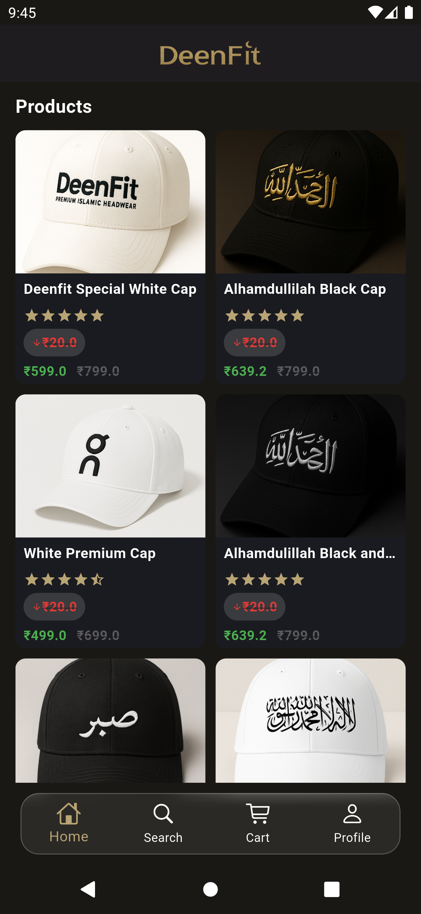

# DeenFitApp 🛍️

A personal Flutter e-commerce application to showcase and sell **custom t-shirts and caps** with beautiful **Urdu, Persian, and Arabic calligraphy** prints.

---

## 📱 Screenshots

<table>
  <tr>
    <td></td>
    <td></td>
    <td></td>
  
  </tr>
  <tr>
    <td></td>
    <td></td>
    <td></td>

  </tr>
</table>

---

## 🚀 Features

- Browse a variety of products with cultural calligraphy art  
- Add to cart & checkout functionality  
- Support for **Urdu, Persian, and Arabic** fonts and designs  
- Clean and modern responsive Flutter UI  
- State management using **BLoC**  

---

## 🛠 Getting Started

### 1. Clone the repository
